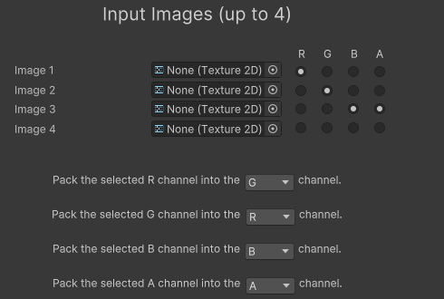
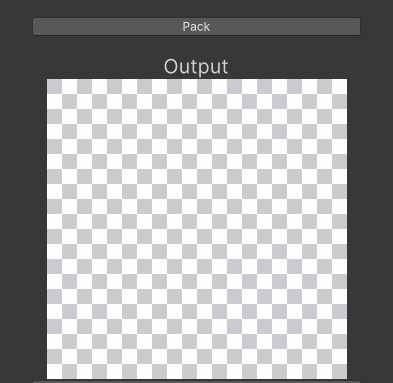

# Channel Packer Tool

This tool allows to pack channels from different images into a new image.

## How to use
### Inputs
Select up to 4 images as inputs. Select the channels you want to extract from each image. \
Then select the destination channel for each of those channel. \
\
Example : \
 \
The R channel from image 1 will be packed into the G channel. \
The G channel from image 1 will be packed into the R channel. \
The B channel from image 1 will be packed into the B channel. \
The A channel from image 1 will be packed into the A channel. 

### Rules
- Only chose channels from images that are imported. The above example will return an error (G, B and A channels are selected on images that aren't imported).
- Destination channels must all be different. Selecting the same channel more than once will result in an error.

### Packing 
Pressing the pack button will pack the channels into a new image which will be previewed in the Output element. \
 

### You're ready to export !

